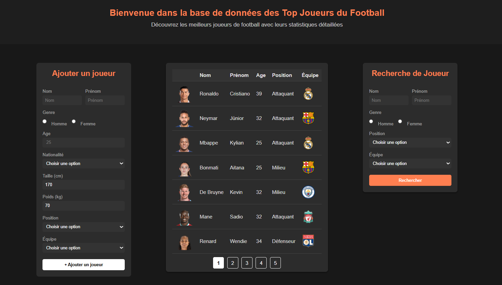
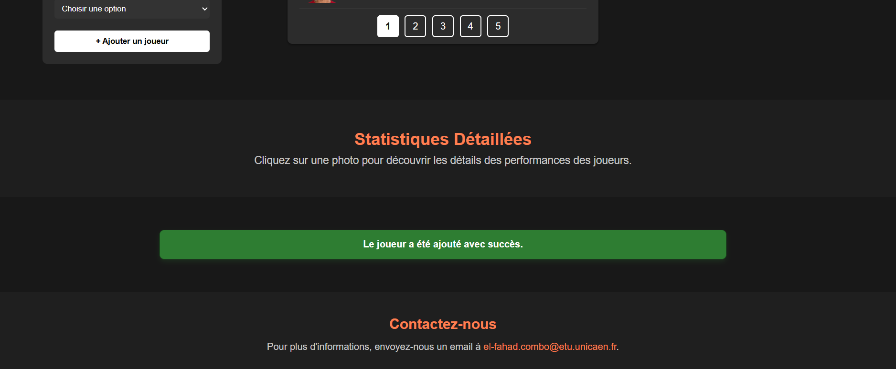
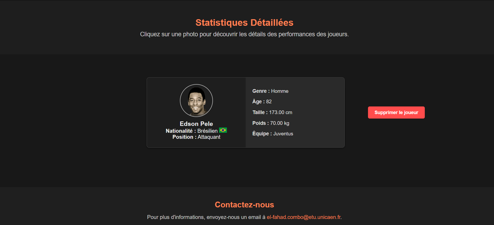
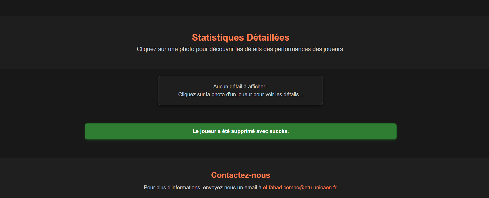

# Base de données – joueurs de football (PHP + PostgreSQL)

Application web pour **gérer une base de joueurs** : ajout, filtrage, détails, suppression et pagination.

- **Stack** : PHP • PostgreSQL • HTML/CSS  
- **Licence** : MIT

---

##  Fonctionnalités

- Ajout d’un joueur via formulaire.
- Recherche/filtrage par **nom, prénom, genre, position, équipe** (combinaisons possibles).
- Table **paginée** avec conservation des filtres.
- Fiche **détaillée** (photo, drapeau, infos) + **suppression**.
- Messages de **feedback** (succès/erreur).

---

##  Structure du projet

```
base-donnees-foot/
├─ public/
│  ├─ controller.php
│  ├─ go.html
│  ├─ gostyle.css
│  └─ images/
│     ├─ flags/      # drapeaux (.png)
│     ├─ équipe/     # logos d’équipe (.png)  
│     └─ joueur/     # photos/avatars joueurs (.png)
├─ sql/
│  └─ table.sql      # création/jeu d’exemple de la table
├─ .gitignore
├─ LICENSE
└─ README.md
```

---

##  Utilisation

- **Ajouter** : remplir le formulaire → **+ Ajouter un joueur**  
- **Rechercher** : renseigner un ou plusieurs critères → **Rechercher**  
- **Détails statistique** : cliquer sur la **photo** dans la table  
- **Supprimer** : bouton dédié dans la fiche détaillée  

---

##  Images 

Le code tente de charger automatiquement des images si elles existent :

- **Joueur** : `public/images/joueur/nom_prenom.png`  
  _ex._ `mbappe_kylian.png`
- **Équipe** : `public/images/equipe/nom_du_club.png`  
  _ex._ `paris_saint-germain.png`
- **Drapeau** : `public/images/flags/nationalite.png`  
  _ex._ `francais.png`, `bresilien.png`

**Règles** : tout en minuscules, espaces → `_`, extension `.png`.  
Des *placeholders* sont utilisés si l’image manque (ex. `default_player.png`, `default.png`).  
Si les dossiers sont vides, ajoutez un fichier vide `.gitkeep` pour les conserver dans Git.

## Visualisations (aperçu)


| Capture | Commentaire |
|---|---|
|  | Accueil avec **table paginée** et **filtres** conservés. |
|  | **Confirmation** après **ajout** d’un joueur.  |
|  | **Carte détaillée** (photo, drapeau, âge, taille, poids, équipe) + bouton **Supprimer**. |
|  | **Confirmation** après **suppression** d’un joueur. |

---


##  Installation locale (rapide)

```sh
git clone https://github.com/elfahad98/base-donnees-foot.git
cd base-donnees-foot

### Créez la base et exécutez le script

psql -U <user_pg> -d postgres -c "CREATE DATABASE foot;"
psql -U <user_pg> -d foot -f sql/table.sql

### Créez **`public/pgsql.php`** avec vos identifiants 
Créez **`public/pgsql.php`** avec vos identifiants :

<?php
// public/pgsql.php
$conn = pg_connect("host=localhost dbname=foot user=<user> password=<password>");
if (!$conn) { die('Connexion PostgreSQL échouée : ' . pg_last_error()); }

### Lancer
php -S localhost:8000 -t public
Puis ouvrez : `http://localhost:8000/controller.php`
```


---

## 👤 Auteur

Projet réalisé par **COMBO El-Fahad** – Université de Caen (2024).  
Contact : `el-fahad.combo@etu.unicaen.fr`

---

## 📄 Licence

Ce projet est sous licence **MIT**. Voir le fichier `LICENSE`.
